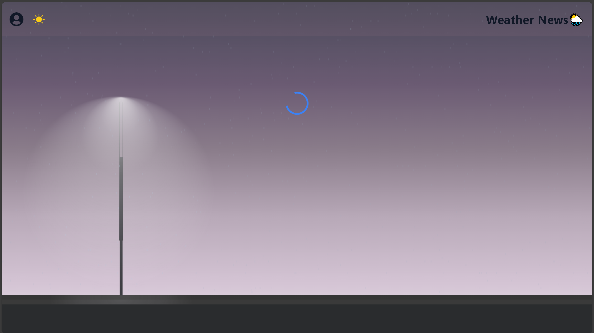

# weathernews

A simple web application built with a Spring Boot backend and a React frontend, featuring smooth and interactive animations powered by Rive.
The app aims to display weather news in an attractive and responsive way, offering a sleek interface and a pleasant user experience across all devices — especially on mobile.

  

  

_animations by Rive_

  

- 
  Rive allows you to design, animate, and interact with vector graphics directly inside your app.
  You can create custom animations (like buttons, loaders, or transitions) and trigger them through code using state machines and events making the UI feel dynamic and alive.

  

🌙 Night Mode Style

In night mode, I created a custom style for this component:
[`src/rain.js`](src/rain.js)

- 

  

🌞 Day Mode Style

In day mode, I designed a bright and clean style for this component:
[`src/rainmorning.js`](src/rainmorning.js)

- 

  
  
  

[@vuvvvv](https://github.com/vuvvvv)
